### About
A learning log of [wgld.org](https://wgld.org/).

### Note
[Learning WebGL | Notion](https://www.notion.so/Learning-WebGL-76235c36fd154a1aac7360f00f5c67c5)

### Rendered
<!--rendered-->
<a href="https://amamagi.github.io/wgld-samples/webgl/w011">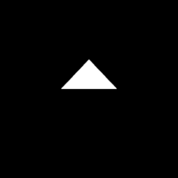</a><a href="https://amamagi.github.io/wgld-samples/webgl/w016">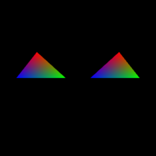</a><a href="https://amamagi.github.io/wgld-samples/webgl/w018">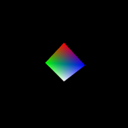</a><a href="https://amamagi.github.io/wgld-samples/webgl/w020">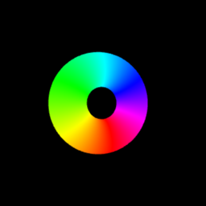</a><a href="https://amamagi.github.io/wgld-samples/webgl/w021">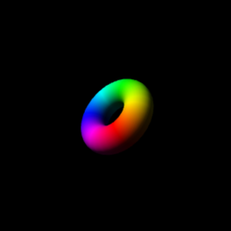</a><a href="https://amamagi.github.io/wgld-samples/webgl/w022">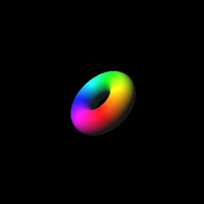</a><a href="https://amamagi.github.io/wgld-samples/webgl/w026">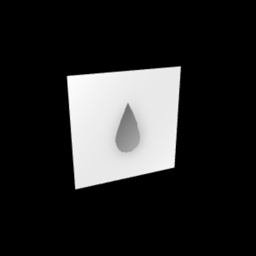</a><a href="https://amamagi.github.io/wgld-samples/webgl/w027">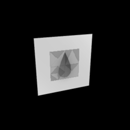</a><a href="https://amamagi.github.io/wgld-samples/webgl/w032">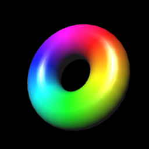</a><a href="https://amamagi.github.io/wgld-samples/webgl/w034">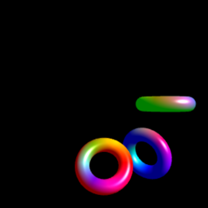</a><a href="https://amamagi.github.io/wgld-samples/webgl/w035">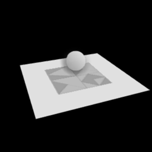</a><a href="https://amamagi.github.io/wgld-samples/webgl/w038">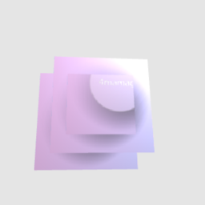</a><a href="https://amamagi.github.io/wgld-samples/webgl/w040">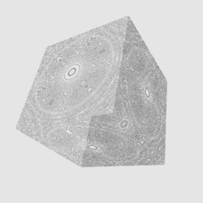</a><a href="https://amamagi.github.io/wgld-samples/webgl/w043">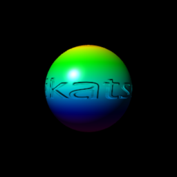</a><a href="https://amamagi.github.io/wgld-samples/webgl/w046">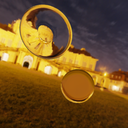</a><a href="https://amamagi.github.io/wgld-samples/webgl/w048">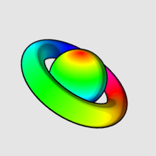</a><a href="https://amamagi.github.io/wgld-samples/webgl/w050">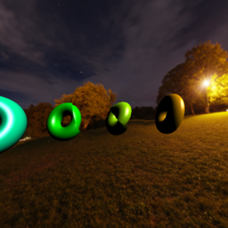</a><a href="https://amamagi.github.io/wgld-samples/webgl/w051">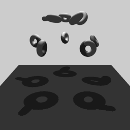</a><a href="https://amamagi.github.io/wgld-samples/webgl/w052">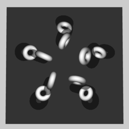</a><a href="https://amamagi.github.io/wgld-samples/webgl/w053">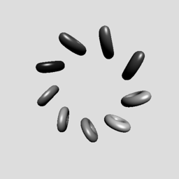</a><a href="https://amamagi.github.io/wgld-samples/webgl/w054">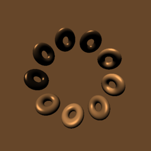</a><a href="https://amamagi.github.io/wgld-samples/webgl/w055">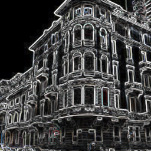</a><a href="https://amamagi.github.io/wgld-samples/webgl/w058">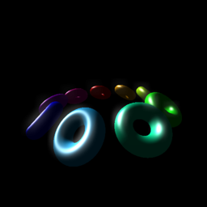</a><a href="https://amamagi.github.io/wgld-samples/webgl/w059">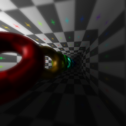</a><a href="https://amamagi.github.io/wgld-samples/webgl/w062">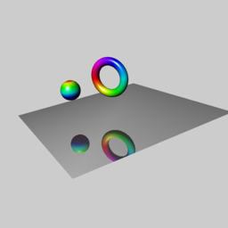</a><a href="https://amamagi.github.io/wgld-samples/webgl/w065">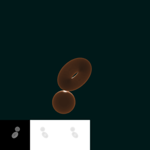</a><a href="https://amamagi.github.io/wgld-samples/webgl/w066">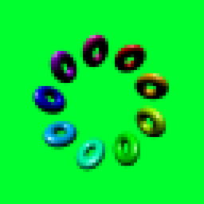</a><a href="https://amamagi.github.io/wgld-samples/webgl/w070">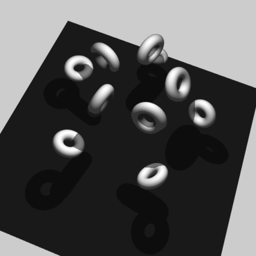</a><a href="https://amamagi.github.io/wgld-samples/webgl/w074">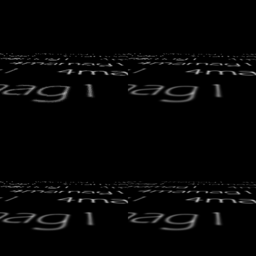</a><a href="https://amamagi.github.io/wgld-samples/webgl/w077">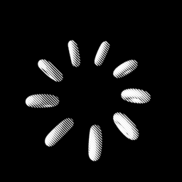</a><a href="https://amamagi.github.io/wgld-samples/webgl/w081">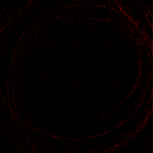</a><a href="https://amamagi.github.io/wgld-samples/webgl/w082">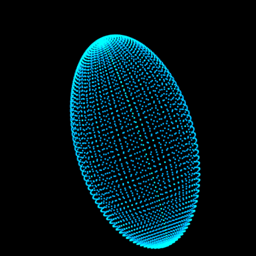</a><a href="https://amamagi.github.io/wgld-samples/webgl/w084">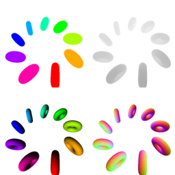</a><a href="https://amamagi.github.io/wgld-samples/webgl/w085">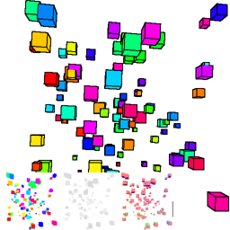</a><a href="https://amamagi.github.io/wgld-samples/webgl/w086">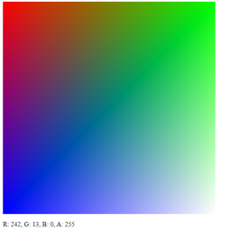</a><a href="https://amamagi.github.io/wgld-samples/webgl/w087">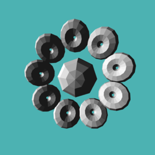</a>
<!--rendered-->