### About
A learning log of [wgld.org](https://wgld.org/).

### Note
[Learning WebGL | Notion](https://www.notion.so/Learning-WebGL-76235c36fd154a1aac7360f00f5c67c5)

### Rendered
<!--rendered-->
<a href="https://amamagi.github.io/wgld-samples/w011">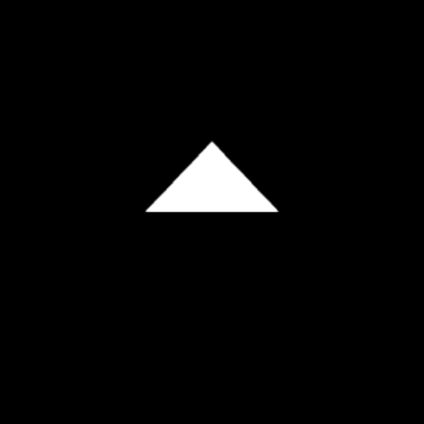</a><a href="https://amamagi.github.io/wgld-samples/w016">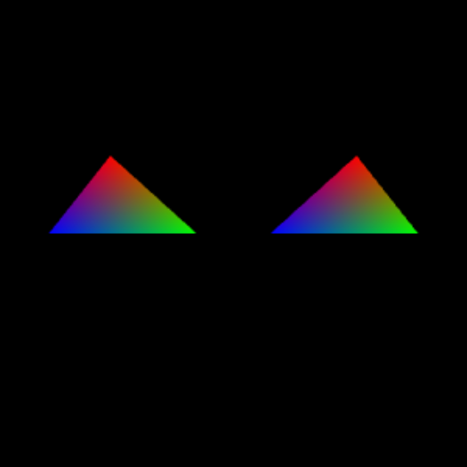</a><a href="https://amamagi.github.io/wgld-samples/w017">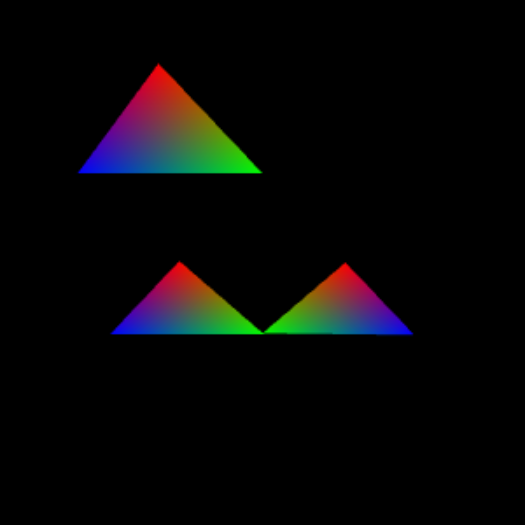</a><a href="https://amamagi.github.io/wgld-samples/w018">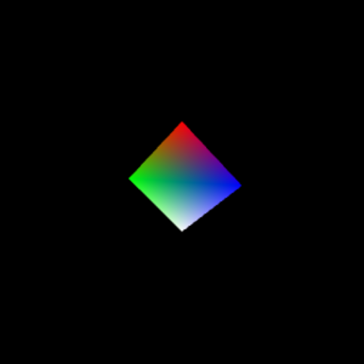</a><a href="https://amamagi.github.io/wgld-samples/w019">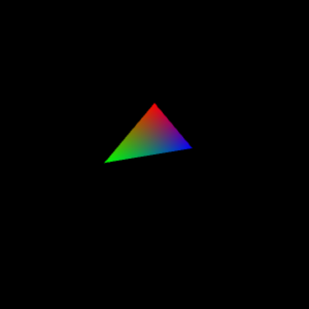</a><a href="https://amamagi.github.io/wgld-samples/w020">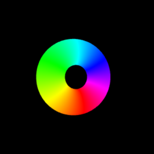</a><a href="https://amamagi.github.io/wgld-samples/w023">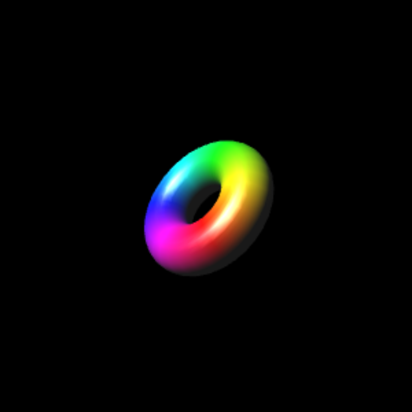</a><a href="https://amamagi.github.io/wgld-samples/w024">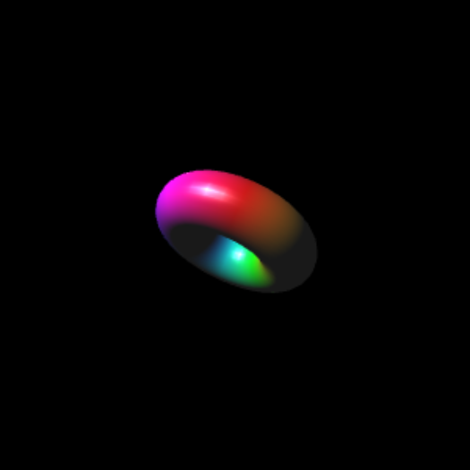</a><a href="https://amamagi.github.io/wgld-samples/w025">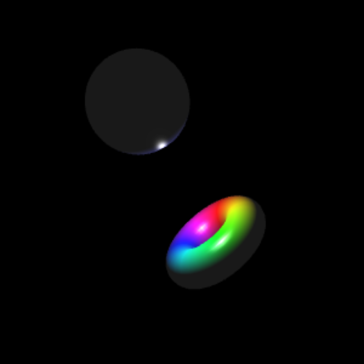</a><a href="https://amamagi.github.io/wgld-samples/w029">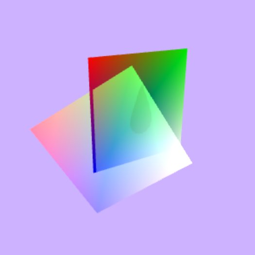</a><a href="https://amamagi.github.io/wgld-samples/w030">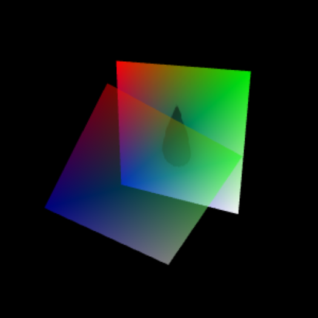</a><a href="https://amamagi.github.io/wgld-samples/w033">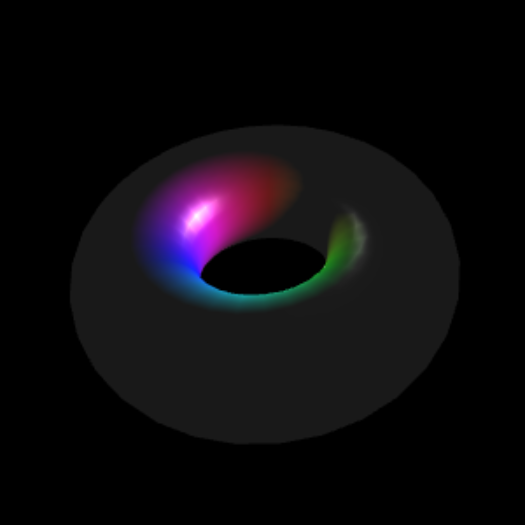</a><a href="https://amamagi.github.io/wgld-samples/w034">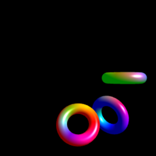</a><a href="https://amamagi.github.io/wgld-samples/w036">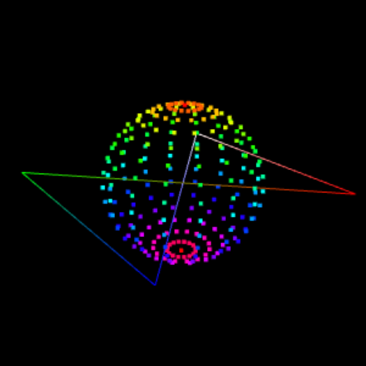</a><a href="https://amamagi.github.io/wgld-samples/w037">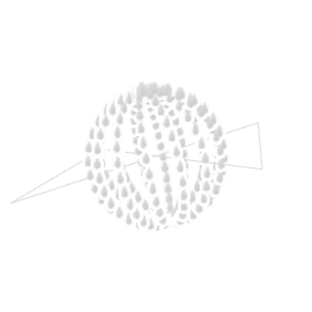</a><a href="https://amamagi.github.io/wgld-samples/w038">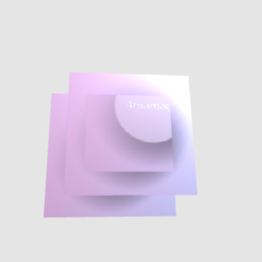</a><a href="https://amamagi.github.io/wgld-samples/w039">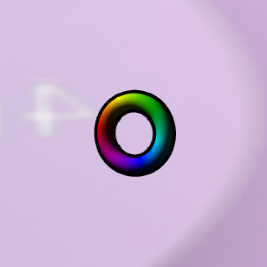</a><a href="https://amamagi.github.io/wgld-samples/w041">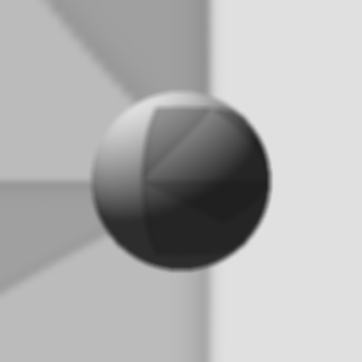</a><a href="https://amamagi.github.io/wgld-samples/w042">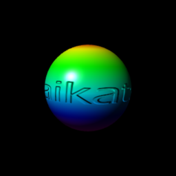</a><a href="https://amamagi.github.io/wgld-samples/w043">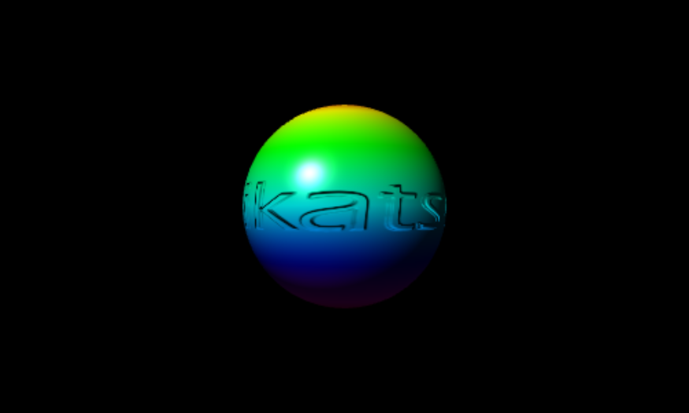</a><a href="https://amamagi.github.io/wgld-samples/w044">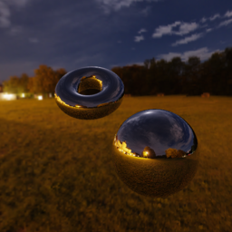</a><a href="https://amamagi.github.io/wgld-samples/w045">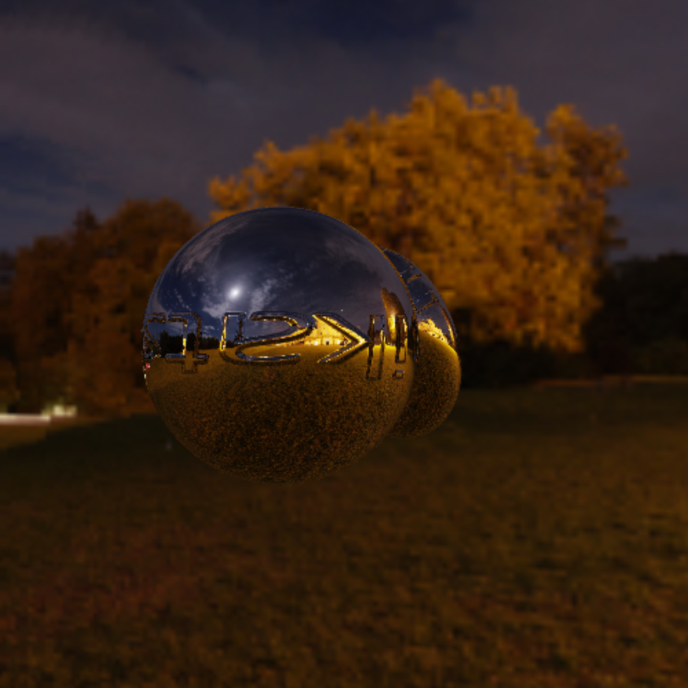</a><a href="https://amamagi.github.io/wgld-samples/w046">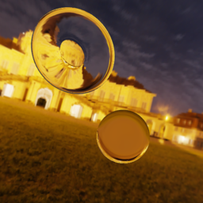</a><a href="https://amamagi.github.io/wgld-samples/w047">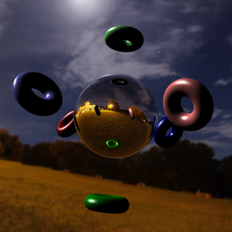</a><a href="https://amamagi.github.io/wgld-samples/w048">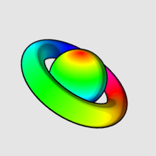</a><a href="https://amamagi.github.io/wgld-samples/w049">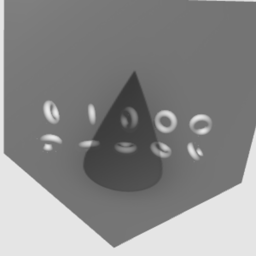</a><a href="https://amamagi.github.io/wgld-samples/w050">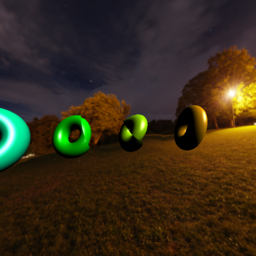</a><a href="https://amamagi.github.io/wgld-samples/w051">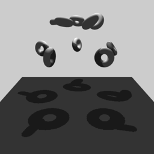</a><a href="https://amamagi.github.io/wgld-samples/w052">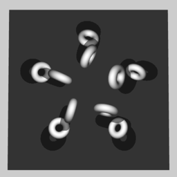</a><a href="https://amamagi.github.io/wgld-samples/w053">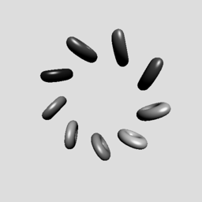</a><a href="https://amamagi.github.io/wgld-samples/w054">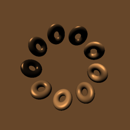</a><a href="https://amamagi.github.io/wgld-samples/w055">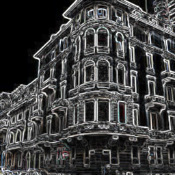</a><a href="https://amamagi.github.io/wgld-samples/w056">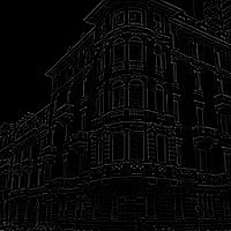</a><a href="https://amamagi.github.io/wgld-samples/w057">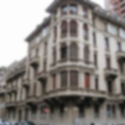</a><a href="https://amamagi.github.io/wgld-samples/w058">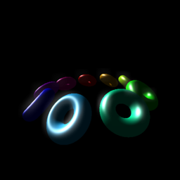</a><a href="https://amamagi.github.io/wgld-samples/w060">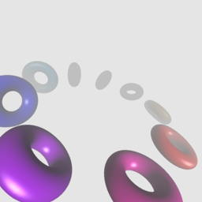</a><a href="https://amamagi.github.io/wgld-samples/w061">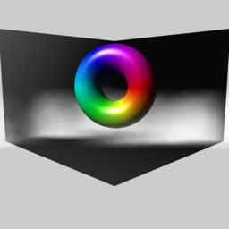</a><a href="https://amamagi.github.io/wgld-samples/w062">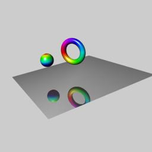</a><a href="https://amamagi.github.io/wgld-samples/w063">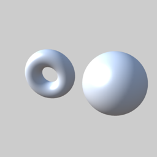</a><a href="https://amamagi.github.io/wgld-samples/w064">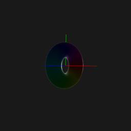</a><a href="https://amamagi.github.io/wgld-samples/w065">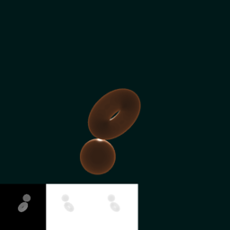</a><a href="https://amamagi.github.io/wgld-samples/w068">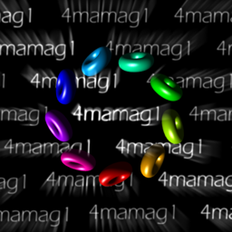</a><a href="https://amamagi.github.io/wgld-samples/w069">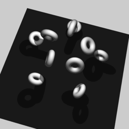</a><a href="https://amamagi.github.io/wgld-samples/w070">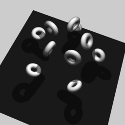</a><a href="https://amamagi.github.io/wgld-samples/w071">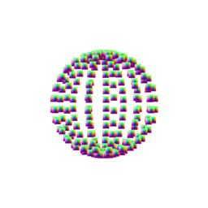</a><a href="https://amamagi.github.io/wgld-samples/w072">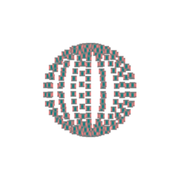</a><a href="https://amamagi.github.io/wgld-samples/w073">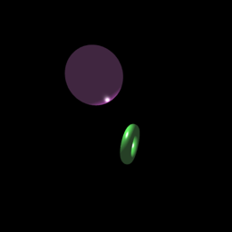</a><a href="https://amamagi.github.io/wgld-samples/w075">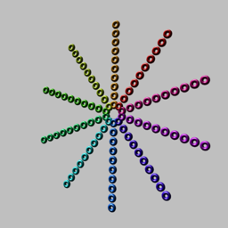</a><a href="https://amamagi.github.io/wgld-samples/w076">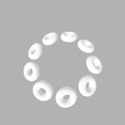</a><a href="https://amamagi.github.io/wgld-samples/w077">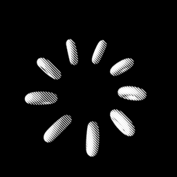</a>
<!--rendered-->