### About
A learning log of [wgld.org](https://wgld.org/).

### Note
[Learning WebGL | Notion](https://www.notion.so/Learning-WebGL-76235c36fd154a1aac7360f00f5c67c5)

### Rendered
<!--rendered-->
<a href="https://amamagi.github.io/wgld-samples/0-webgl/w011">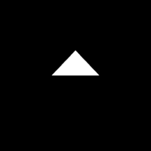</a><a href="https://amamagi.github.io/wgld-samples/0-webgl/w015">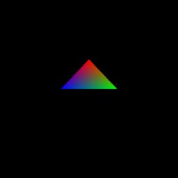</a><a href="https://amamagi.github.io/wgld-samples/0-webgl/w016">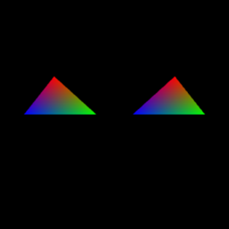</a><a href="https://amamagi.github.io/wgld-samples/0-webgl/w018">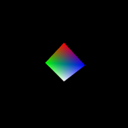</a><a href="https://amamagi.github.io/wgld-samples/0-webgl/w021">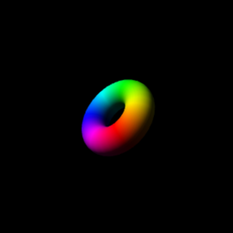</a><a href="https://amamagi.github.io/wgld-samples/0-webgl/w022">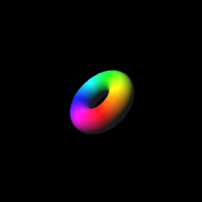</a><a href="https://amamagi.github.io/wgld-samples/0-webgl/w027">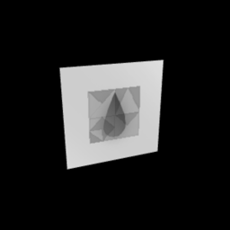</a><a href="https://amamagi.github.io/wgld-samples/0-webgl/w029">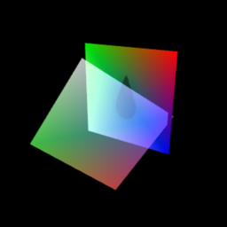</a><a href="https://amamagi.github.io/wgld-samples/0-webgl/w032">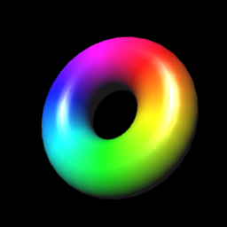</a><a href="https://amamagi.github.io/wgld-samples/0-webgl/w035">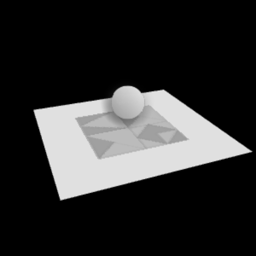</a><a href="https://amamagi.github.io/wgld-samples/0-webgl/w038">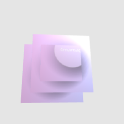</a><a href="https://amamagi.github.io/wgld-samples/0-webgl/w040">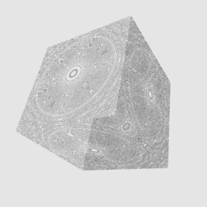</a><a href="https://amamagi.github.io/wgld-samples/0-webgl/w042">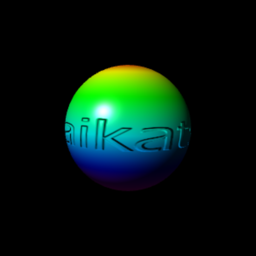</a><a href="https://amamagi.github.io/wgld-samples/0-webgl/w043">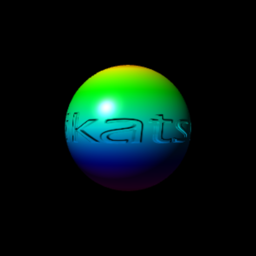</a><a href="https://amamagi.github.io/wgld-samples/0-webgl/w044">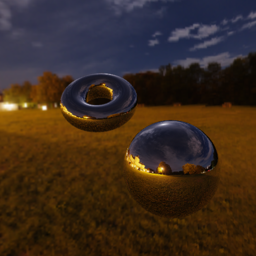</a><a href="https://amamagi.github.io/wgld-samples/0-webgl/w047">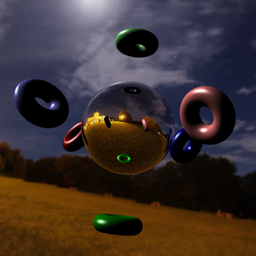</a><a href="https://amamagi.github.io/wgld-samples/0-webgl/w049">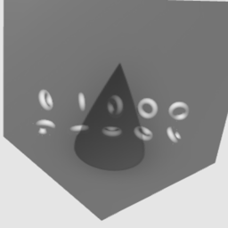</a><a href="https://amamagi.github.io/wgld-samples/0-webgl/w056">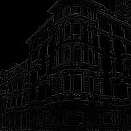</a><a href="https://amamagi.github.io/wgld-samples/0-webgl/w057">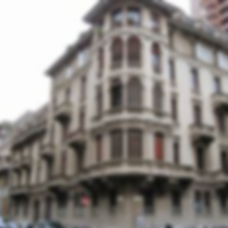</a><a href="https://amamagi.github.io/wgld-samples/0-webgl/w059">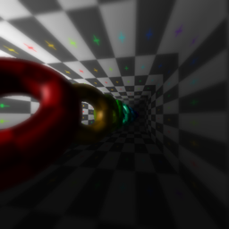</a><a href="https://amamagi.github.io/wgld-samples/0-webgl/w060">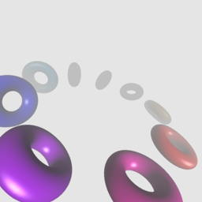</a><a href="https://amamagi.github.io/wgld-samples/0-webgl/w061">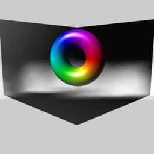</a><a href="https://amamagi.github.io/wgld-samples/0-webgl/w063">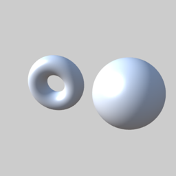</a><a href="https://amamagi.github.io/wgld-samples/0-webgl/w064">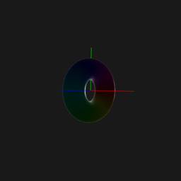</a><a href="https://amamagi.github.io/wgld-samples/0-webgl/w066">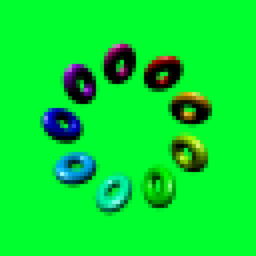</a><a href="https://amamagi.github.io/wgld-samples/0-webgl/w068">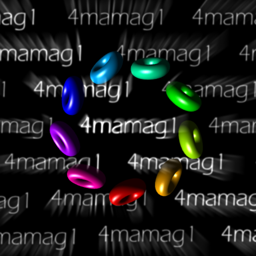</a><a href="https://amamagi.github.io/wgld-samples/0-webgl/w069">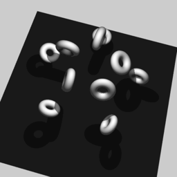</a><a href="https://amamagi.github.io/wgld-samples/0-webgl/w071">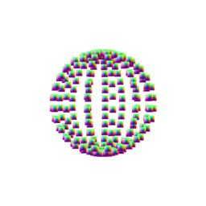</a><a href="https://amamagi.github.io/wgld-samples/0-webgl/w072">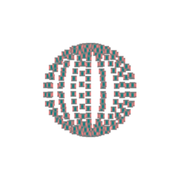</a><a href="https://amamagi.github.io/wgld-samples/0-webgl/w073">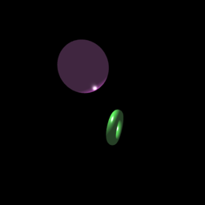</a><a href="https://amamagi.github.io/wgld-samples/0-webgl/w074">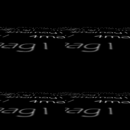</a><a href="https://amamagi.github.io/wgld-samples/0-webgl/w075">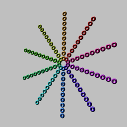</a><a href="https://amamagi.github.io/wgld-samples/0-webgl/w076">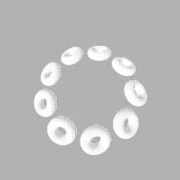</a><a href="https://amamagi.github.io/wgld-samples/0-webgl/w083">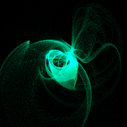</a><a href="https://amamagi.github.io/wgld-samples/0-webgl/w089">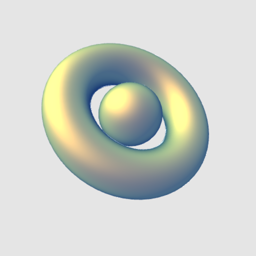</a><a href="https://amamagi.github.io/wgld-samples/1-webgl2/w015">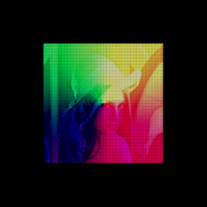</a>
<!--rendered-->